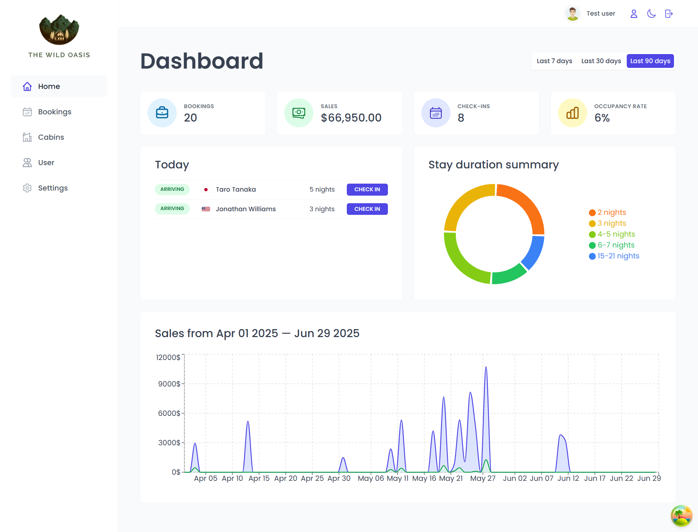
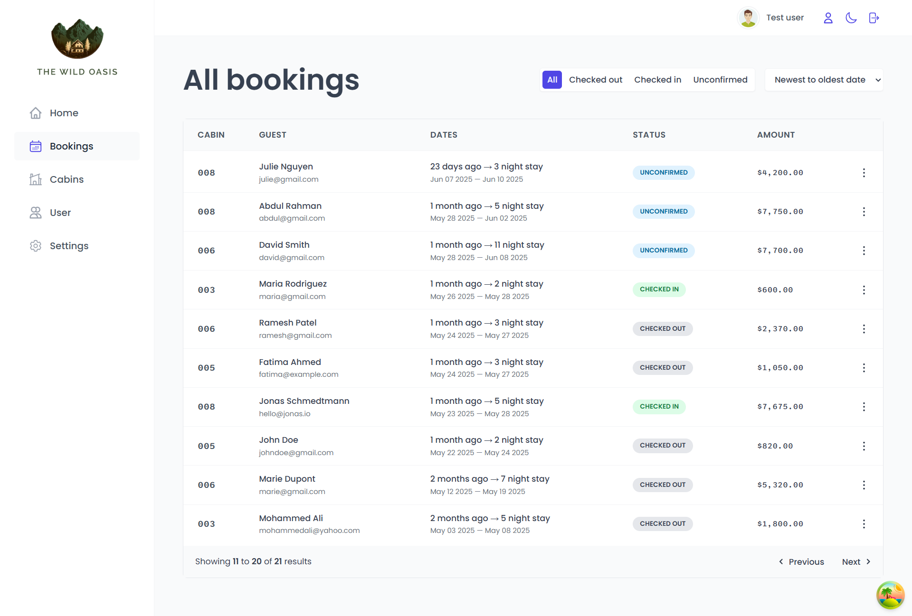
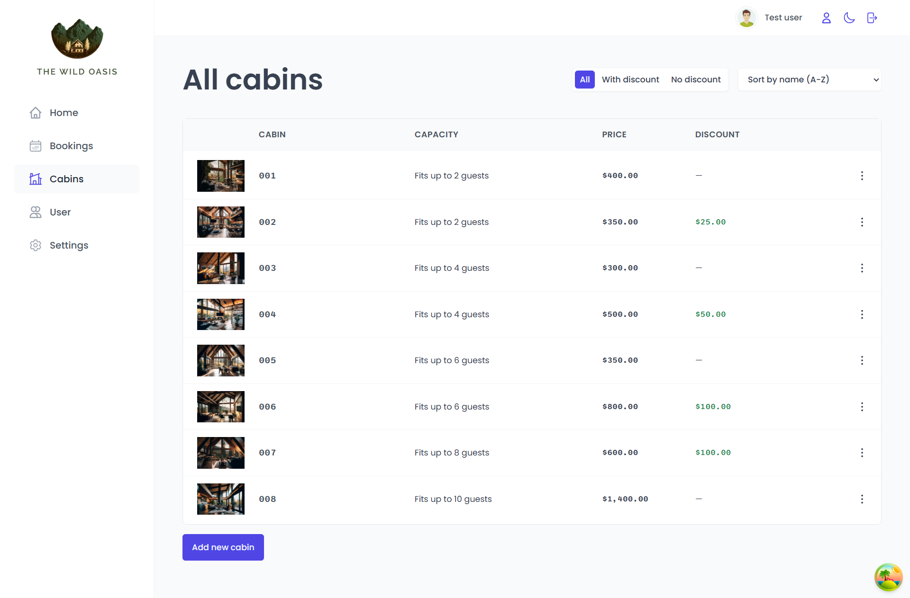
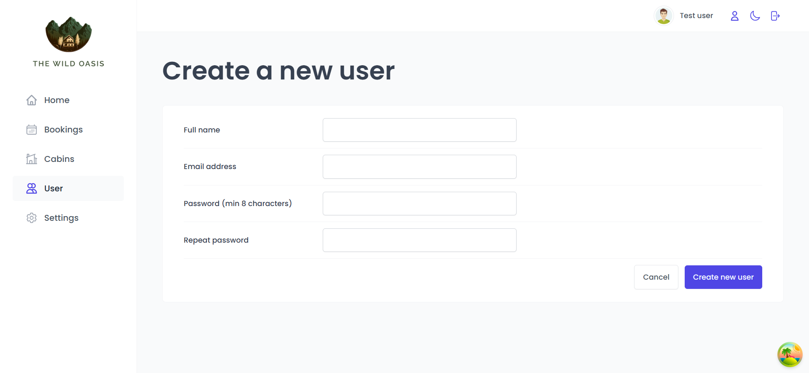
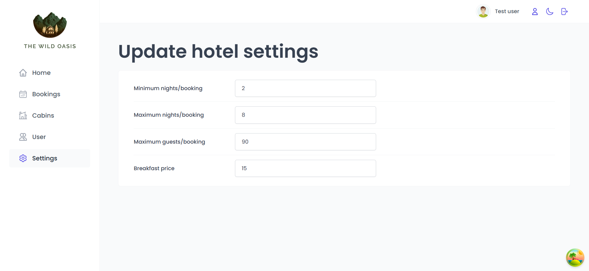
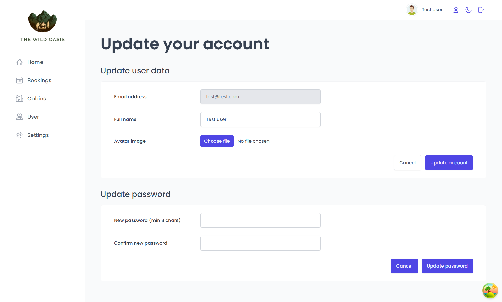
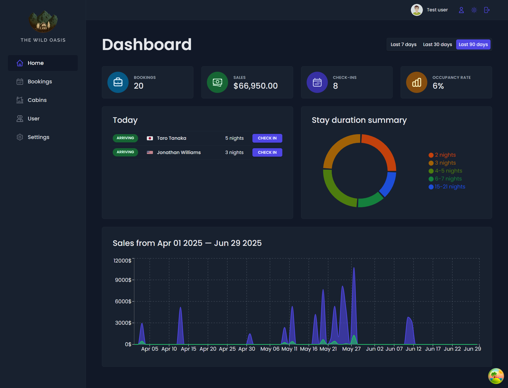

# 🏝️ The Wild Oasis – Hotel Management Application

(Built as part of “The Ultimate React Course” by Jonas Schmedtmann)

Welcome to **The Wild Oasis**, a modern hotel management application designed to streamline daily operations for boutique hotels. Manage bookings, guests, cabins, and more—all from a beautiful, intuitive dashboard.

---

🚀 Features

- **Authentication:** Secure login for hotel staff with account creation restricted to the app. Users can upload avatars and update personal info.
- **Dashboard:** Real-time overview of bookings, check-ins, check-outs, sales, and occupancy with visual stats and quick actions.
- **Booking Management:** View, filter, and manage bookings including dates, status, payment, guest details, and breakfast options.
- **Cabin Inventory:** Manage cabins with photos, capacity, pricing, discounts, and full create, update, delete functionality.
- **Guest Records:** Store guest details like full name, email, national ID, nationality, and display country flags for easy ID.
- **Dark Mode:** Built-in dark theme for comfortable use anytime.

---

## 🖥️ Tech Stack

- **Frontend:** React, Styled Components, React Router
- **State Management:** React Context, React Query
- **Backend:** Supabase (PostgreSQL, Auth, Storage)
- **Build Tool:** Vite

---

# 🌐 Live Demo

Check out the live site here:  
[https://the-wild-oasis-qinangao.netlify.app](https://the-wild-oasis-qinangao.netlify.app)

---

## 🎮 Demo Account

Use the following credentials to explore the application:

- **Email:** `test@test.com`
- **Password:** `12345678`

---

## 🖥️ Demonstration

Home page


Bookings


Cabins


User


Setting


Account


Dark Mode


## 🛠️ Getting Started

1. **Clone the repository:**
   ```sh
   git clone https://github.com/your-username/the-wild-oasis.git
   cd the-wild-oasis
   ```
2. **Install dependencies:**
   ```sh
   npm install
   ```
3. **Run the application:**
   ```sh
   npm run dev
   ```
4. **Open your browser and navigate to** `http://localhost:5173`

---

## 🙏 Acknowledgements

- [Jonas Schmedtmann](https://codingheroes.io/) for the course and inspiration.
- [Supabase](https://supabase.com/) for the backend platform.
- [React](https://react.dev/) for the frontend framework.
